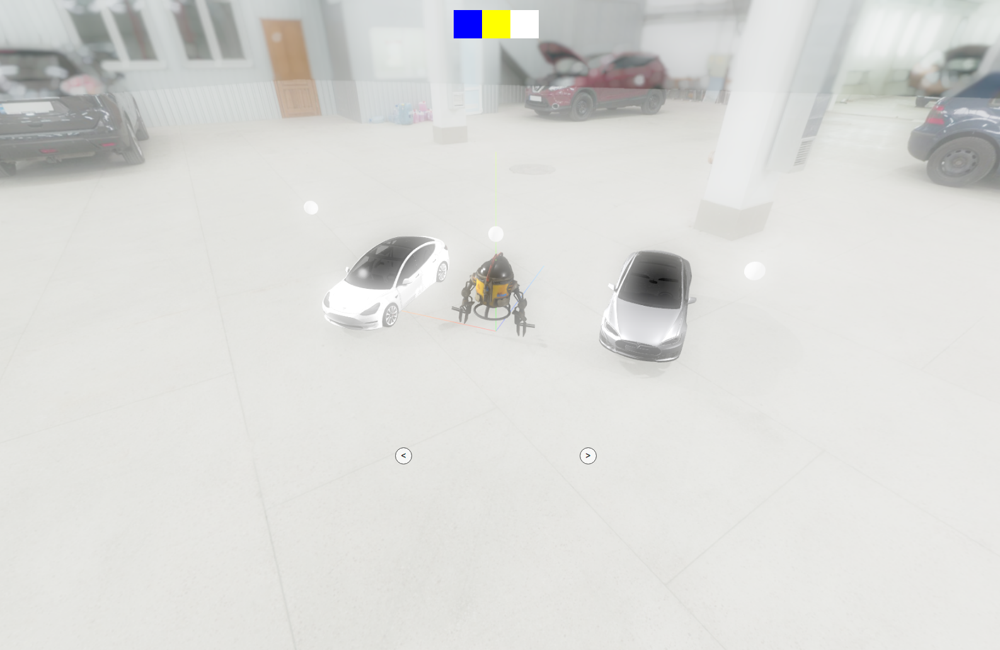

# Car(Three.js)

This project was bootstrapped with [Create React App](https://github.com/facebook/create-react-app).

## Screenshots

## Available Scripts

In the project directory, you can run:

### `yarn start`
### `yarn test`
### `yarn build`
### `yarn eject`
